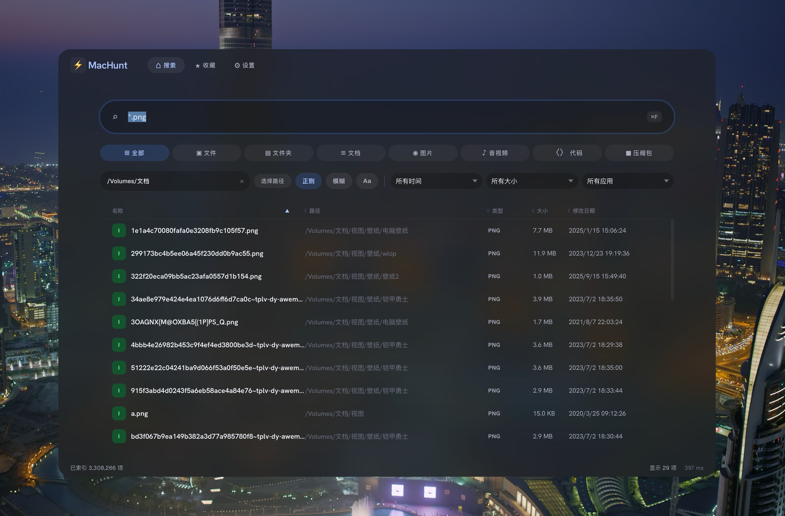
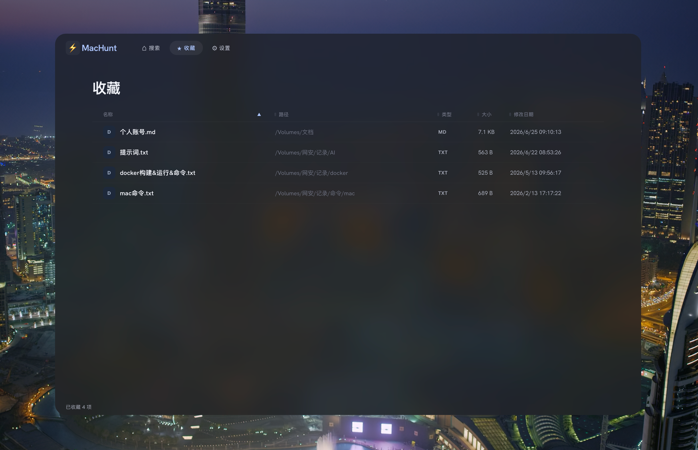
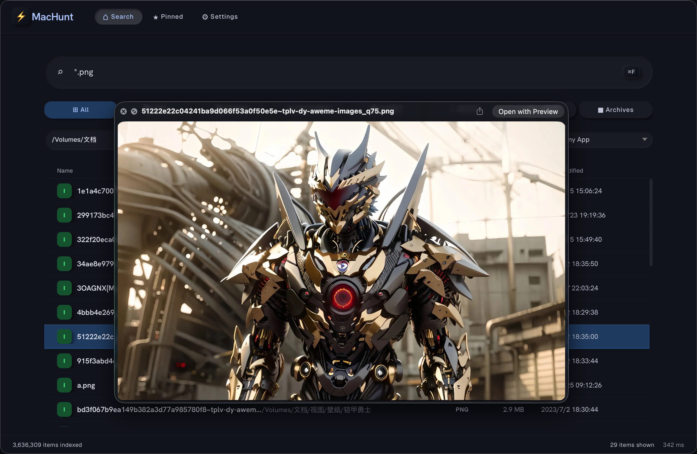
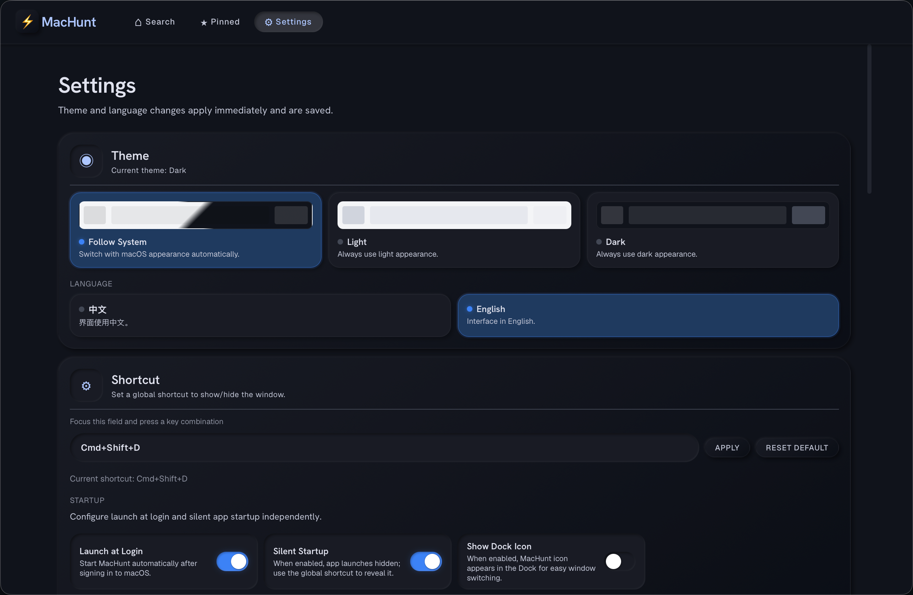

<p align="center"></p>

<h1 align="center">MacHunt</h1>

<p align="center">
  
  
  
  
  
  
  
</p>

A fully local macOS file/folder search tool with both CLI and native GUI (Tauri + React). No HTTP backend, no cloud services.

[中文文档](README_zh.md)

## Introduction

MacHunt scans your entire filesystem into a local SQLite FTS5 index. CLI searches complete in <5ms. It uses macOS FSEvents for incremental live updates. Think Spotlight, but fully open source, with a powerful CLI, and your data never leaves your machine.

## Screenshots

<table>
<thead>
<tr>
<th width="50%" align="center">Search</th>
<th width="50%" align="center">Pinned</th>
</tr>
</thead>
<tbody>
<tr>
<td align="center"><a target="_blank" rel="noopener noreferrer" href="./screenshots/search.png"></a></td>
<td align="center"><a target="_blank" rel="noopener noreferrer" href="./screenshots/pinned.png"></a></td>
</tr>
<tr>
<td align="center"><strong>Full-disk search, category tabs</strong></td>
<td align="center"><strong>Pinned favorites, persistent across restarts</strong></td>
</tr>
</tbody>
</table>

<table>
<thead>
<tr>
<th width="50%" align="center">Quick Look Preview</th>
<th width="50%" align="center">Settings</th>
</tr>
</thead>
<tbody>
<tr>
<td align="center"><a target="_blank" rel="noopener noreferrer" href="./screenshots/quicklook.png"></a></td>
<td align="center"><a target="_blank" rel="noopener noreferrer" href="./screenshots/settings.png"></a></td>
</tr>
<tr>
<td align="center"><strong>Space-triggered native Quick Look</strong></td>
<td align="center"><strong>Settings</strong></td>
</tr>
</tbody>
</table>

## Install

Download the latest `.dmg` from [GitHub Releases](https://github.com/dacj4n/MacHunt/releases), mount it, and drag `MacHunt.app` to `/Applications`.

> **First launch**: macOS Gatekeeper may block unsigned apps. If you see "cannot be verified", right-click `MacHunt.app` in Finder and select **Open**, then click **Open** in the dialog. Or run `xattr -cr /Applications/MacHunt.app` in Terminal.

Or build from source:

```bash
git clone https://github.com/dacj4n/MacHunt.git
cd MacHunt
```

### CLI only

```bash
cargo build --release
./target/release/machunt --help
```

### GUI (dev)

```bash
npm install
npm run tauri dev
```

### GUI (package)

```bash
npm run build
npm run tauri build
```

## Requirements

| macOS 15 (Apple Silicon) | ✅ Tested |
| macOS 13–14 | ✅ Expected to work |
| macOS 10.15–12 | ⚠️ Theoretically supported (not tested) |
| Intel Mac (x86_64) | ⚠️ Universal binary included (not tested) |

> **Note**: The app is built as a universal binary (arm64 + x86_64). On macOS <13, login items use AppleScript fallback instead of the modern ServiceManagement API.

- Rust 1.70+
- Node.js 18+ (GUI only)
- npm 9+ (GUI only)

## Quick Start

```bash
# First, build the index (scans your entire disk — takes ~10s for 3M files)
machunt build

# Substring search (case-insensitive)
machunt search "budget"

# Wildcard pattern
machunt search -p "*.rs"

# Fuzzy search (space-separated, multi-token substring AND matching)
machunt search -F "sys remote"

# Case-sensitive
machunt search -c "Makefile"

# JSON output for scripting
machunt search --json "invoice" | jq .

# Start live watcher + interactive search
machunt watch
```

## CLI Reference

```
machunt <COMMAND>
```

### `search`

```bash
machunt search [OPTIONS] <QUERY>
```

| Option | Description |
|--------|-------------|
| `-p, --pattern` | Wildcard mode (e.g. `*.rs`, `test?.txt`) |
| `-F, --fuzzy` | Multi-token fuzzy search (space-separated, AND matching) |
| `-c, --case-sensitive` | Case-sensitive matching |
| `-n, --limit <N>` | Max results (default 100) |
| `-P, --path <PATH>` | Path prefix filter |
| `-f, --files` | Files only |
| `-d, --dirs` | Directories only |
| `--json` | JSON output |

Wildcard rules:
- `*` — matches anything except `/` (single directory level)
- `**` — matches anything including `/` (all levels)
- `?` — matches single character except `/`
- `{a,b}` — matches `a` or `b`

### `build`

```bash
machunt build [OPTIONS]
```

| Option | Description |
|--------|-------------|
| `-p, --path <PATH>` | Build only this scope |
| `--rebuild` | Clear old index first |
| `--include-dirs <true\|false>` | Include directories (default `true`) |

### `watch`

```bash
machunt watch
```

Starts FSEvents watcher with incremental updates. Resumes from last EventID when available. Drops into an interactive search loop.

### `optimize`

```bash
machunt optimize [--vacuum]
```

Runs WAL checkpoint (always). Optional `--vacuum` reclaims DB file space.

## How It Works

```
┌──────────┐     ┌───────────────┐     ┌──────────┐
│  WalkDir │ ──→ │  SQLite FTS5  │ ←── │ FSEvents │
│  (build) │     │  (trigram)    │     │  (watch) │
└──────────┘     └───────┬───────┘     └──────────┘
                         │
                    ┌────▼────┐
                    │  Search │
                    │ <5ms    │
                    └─────────┘
```

- **Build**: `WalkDir` traverses the filesystem, inserting `(name_lower, path)` into SQLite FTS5 with the trigram tokenizer. Handled in parallel via crossbeam channels.
- **Search**: FTS5 trigram `MATCH` answers substring queries in single-digit milliseconds (CLI). Queries shorter than 3 characters, and non-ASCII queries such as Chinese, fall back to a `LIKE` scan — still fast for everyday use, but the slowest path on multi-million-file indexes. Case-sensitive queries add a GLOB post-filter (SQLite `LIKE` is ASCII-case-insensitive by default). Fuzzy mode uses space-separated multi-token substring AND matching over `LIKE` candidates.
- **Watch**: Raw FSEvents FFI (CoreServices) streams file creation, modification, deletion, and rename events. Inserts/updates/deletes from the DB incrementally. Resumes from the last persisted EventID across restarts.
- **Volumes**: `/Volumes` is polled every 10 seconds for mounted disks, because FSEvents does not report changes on SMB/WebDAV shares. A new volume is indexed in the background; unmounting clears its entries right away.

## GUI

The native macOS GUI is built with Tauri 2 and React. It communicates with the same Rust core engine used by the CLI — no HTTP server, no IPC overhead beyond Tauri's native bridge.

### Main Window

- Full-disk search with real-time results
- Navigation tabs: Search / Pinned / Settings (`Cmd+1/2/3`)
- Wildcard toggle + case-sensitive toggle
- Path filter with suggestion dropdown and Finder picker
- Filters: App (186 extension mappings), Time (calendar date range), Size (custom value + unit)
- Fuzzy search toggle (space-separated, multi-token AND matching)
- Category tabs: All / Files / Folders / Documents / Images / Media / Code / Archives
- Sortable columns: name, path, type, size, modified
- Draggable column splitters with persisted widths
- Single/multi selection (`Shift` range, `Cmd` additive)
- Space-triggered Quick Look (multi-selection supported)
- Double-click to open
- Inline pin button on each result row (hover to reveal)

### Keyboard

The window focuses the search field when it opens, with the text selected — so you can start typing immediately. `Tab` moves focus between the search field and the result list; the arrow keys and `Enter` act on whichever has focus.

| Shortcut | Action |
|----------|--------|
| `Tab` | Move focus between the search field and the result list |
| `↑` `↓` | Move the selection (while the result list has focus) |
| `Enter` / `Cmd+O` | Open the selected item |
| `Space` | Quick Look preview (multi-selection supported) |
| `Cmd+A` | Select all results |
| `Cmd+C` | Copy the selected items as file objects |
| `Cmd+F` | Focus and select the search field |
| `Cmd+1` / `Cmd+2` / `Cmd+3` | Search / Pinned / Settings view |
| `Esc` | Hide the window |
| `Cmd+Shift+D` | Show/hide the window globally (configurable in Settings) |

Inside the path filter field, `↑` `↓` `Enter` and `Esc` navigate the suggestion dropdown.

### Menu Bar Icon

MacHunt lives in the menu bar. Clicking the icon toggles the window and lands on the search field; the icon's menu has Search, Pinned, Settings (`Cmd+,`) and Quit (`Cmd+Q`). The icon is a template image, so it follows the light/dark menu bar automatically, and its menu labels follow the app language. The icon can be hidden from Settings → Startup.

### External Volumes

Mounted disks are handled outside FSEvents: `/Volumes` is polled every 10 seconds, because FSEvents does not report changes on SMB/WebDAV shares. A newly mounted volume is indexed in the background and its files show up in results as they are indexed; unmounting removes its entries immediately. The app is notified when a volume is detected, when its indexing finishes, and when it disappears.

### Right-Click Menu

Open, Open With... (Finder / QSpace Pro / Terminal / WezTerm), copy name/path, copy as file objects, copy all results, move to Trash, Pin to Favorites.

### Pinned / Favorites

Star any search result to pin it. Pinned items persist in localStorage and survive restarts — no DB mix. The dedicated Pinned tab shows all bookmarked items with full sort, resize, Quick Look, and Cmd+A support. Unpin via the same star button or context menu. Star ⭑ appears at the end of every row (visible on hover). Gold filled = pinned, outline = not.

### Settings Page

- **Theme**: follow system / light / dark
- **Language**: 中文 / English
- **Shortcut**: global hotkey to show/hide the window (default `Cmd+Shift+D`)
- **Startup**: launch at login, silent start, show/hide Dock icon, show/hide menu bar icon
- **Results**: maximum number of results kept in the list
- **Index maintenance**: automatic `VACUUM` after a rebuild, plus rebuild and watch controls
- **Excluded directories**: exact paths, plus regex/wildcard patterns (tried as regex first, wildcard as fallback)
- **Excluded files**: skip dotfiles, plus filename patterns
- **Watch roots**: which subtrees FSEvents monitors
- **Default actions**: what a double-click opens (Finder / QSpace Pro / custom app) and which terminal to use (Terminal / WezTerm / custom app)
- **Updates**: check automatically, or check now

### Update Check

MacHunt can compare its version against the latest release tag on GitHub Releases. This is on by default, can be turned off in Settings, and there is a manual "check now" button. The request only carries the current version in its user agent — nothing about your files, your index, or your searches is sent.

## Features

| Category | Capability |
|----------|------------|
| Search modes | Substring, wildcard, fuzzy (multi-token) |
| Case sensitivity | Toggleable in both CLI and GUI |
| Path filter | Prefix, suggestion dropdown, Finder picker |
| App filter | 186 extension → default app mappings |
| Time/Size filters | Custom calendar range / value + unit |
| Live updates | FSEvents watcher, persists EventID across restarts |
| External volumes | Auto index on mount, auto cleanup on unmount |
| File types | 8 category tabs via extension classification |
| Pinned items | Star button, persistent favorites page, localStorage |
| Preview | Native Quick Look (space bar, multi-file) |
| Export | Copy as file objects, JSON output (CLI) |
| Menu bar | Tray icon with Search / Pinned / Settings / Quit |
| Updates | Optional GitHub Releases check, automatic or manual |
| Design | Liquid Glass design system, follow-system/light/dark theme |
| i18n | 中文 / English |
| Startup | Launch at login, silent mode, Dock and menu bar icon toggles |
| Performance | EventID staleness detection, lazy dead-path cleanup |
| Privacy | Fully local index — files and searches stay on your machine |

## Comparison

| | MacHunt | Spotlight | Raycast | uTools |
|---|---|---|---|---|
| **Full disk scan** | Yes (~10s / 3M files) | Yes (`mdfind`) | Plugin-based | Plugin-based |
| **Search latency** | <5ms (CLI, FTS5 trigram) | 50–200ms+ | Varies | Varies |
| **Index format** | SQLite FTS5 (open) | Proprietary | Proprietary | N/A |
| **CLI** | Yes | Yes (`mdfind`) | No | No |
| **Fuzzy search** | Yes (multi-token) | Partial | No | No |
| **Incremental update** | FSEvents | FSEvents | Varies | N/A |
| **Open source** | Yes | No | No | Partially |

## Development

### Tech Stack

- **Core**: Rust
- **CLI**: Clap
- **GUI frontend**: React 18 + TypeScript + Vite
- **GUI container**: Tauri 2
- **Global shortcut**: `tauri-plugin-global-shortcut`
- **Storage**: SQLite FTS5 (`rusqlite`, WAL mode, trigram tokenizer)
- **Scanner**: WalkDir + Crossbeam channels
- **Watcher**: macOS FSEvents (CoreServices FFI)
- **Design**: macOS 26 Liquid Glass — a native `NSVisualEffectView` backdrop with a CSS custom-property layer on top, and inline theme detection for a flash-free startup

### Build Commands

| Command | What it does |
|---------|--------------|
| `npm run build` | Build frontend only (TS + Vite → `dist/`) |
| `npm run tauri build` | Full build: frontend + Rust → `.app` / `.dmg` |
| `npm run tauri dev` | Dev mode with hot reload |
| `cargo build --release` | CLI binary only |

### `npm run build` vs `npm run tauri build`

- `npm run build` only builds frontend assets. It does **not** compile Rust, does **not** produce a `.app` or `.dmg`.
- `npm run tauri build` runs `beforeBuildCommand` (which is `npm run build`), then compiles the Rust backend, and produces installable artifacts.

## Project Structure

```
mac_find/
├── src/                      # Rust core engine *and* React frontend share this directory
│   ├── main.rs               # CLI entry point (clap)
│   ├── lib.rs                # Library root, re-exports Engine
│   ├── engine.rs             # Engine: build / search / watch orchestration
│   ├── db.rs                 # SQLite FTS5: schema, insert, search, fuzzy
│   ├── builder.rs            # WalkDir filesystem scanner
│   ├── watcher.rs            # FSEvents FFI watcher
│   ├── search.rs             # Wildcard-to-regex conversion
│   ├── filters.rs            # Exclude rules (exact + wildcard)
│   ├── apps.rs               # Extension → default app mapping (186 entries)
│   ├── model.rs              # Shared types (FileEntry, SearchOptions)
│   ├── utils.rs              # Path normalization, skip logic, logger
│   ├── App.tsx               # React app shell: state, views, keyboard handling
│   ├── App.css               # Liquid Glass design system (CSS custom properties)
│   ├── main.tsx              # React entry point
│   ├── i18n.ts               # 中文 / English strings
│   ├── types.ts              # Frontend types
│   ├── utils.ts              # Frontend helpers (filters, formatting, storage)
│   └── components/
│       ├── SearchView.tsx    # Result table, filters, status bar
│       ├── SettingsView.tsx  # Settings page
│       ├── ContextMenu.tsx   # Right-click menu
│       └── CustomSelect.tsx  # Styled dropdown
├── src-tauri/                # Tauri GUI backend
│   ├── src/
│   │   ├── lib.rs            # App setup, window lifecycle, command registration
│   │   ├── commands/mod.rs   # Every #[tauri::command] handler
│   │   ├── window.rs         # Show/hide, Liquid Glass backdrop, window appearance
│   │   ├── settings.rs       # settings.json persistence (GuiSettings, AppState)
│   │   ├── file_ops.rs       # Open / reveal / preview / clipboard / trash
│   │   ├── tray.rs           # Menu bar icon and its menu
│   │   ├── menu.rs           # macOS application menu
│   │   ├── startup.rs        # Launch at login (SMAppService + AppleScript fallback)
│   │   └── ffi.rs            # Activation-policy bridge
│   ├── macos/
│   │   └── quicklook_bridge.m  # ObjC bridge: Quick Look, clipboard, Dock
│   ├── capabilities/         # Tauri permission capabilities
│   ├── icons/                # App icons
│   ├── build.rs              # Build script (compiles the ObjC bridge)
│   ├── Info.plist            # macOS bundle metadata
│   └── tauri.conf.json       # Tauri configuration
├── public/fonts/             # Self-hosted fonts (Hanken Grotesk, Geist)
├── screenshots/              # Screenshots for this README
├── .github/workflows/        # Release CI
├── index.html                # HTML shell, inline theme detection script
├── Cargo.toml                # Rust crate manifest
├── package.json              # Frontend dependencies
├── tsconfig.json             # TypeScript config
├── vite.config.ts            # Vite config
└── VERSION                   # Current version
```

> The Rust engine and the React frontend deliberately live in the same `src/` directory: the CLI and the GUI link against the exact same crate, so there is only ever one implementation of searching, indexing and watching.

## Runtime Data

| Path | Content |
|------|---------|
| `~/Library/Caches/MacHunt/index.db` | FTS5 search index |
| `~/Library/Application Support/MacHunt/settings.json` | GUI settings |
| `~/Library/Caches/MacHunt/logs/` | Debug logs |

## Why the Index Can Be Large

- Millions of files are common on macOS
- Directory entries are indexed by default
- Long paths dominate storage
- `index.db-wal` can grow temporarily during writes

Maintenance:

```bash
machunt optimize --vacuum
```

## License

MIT
