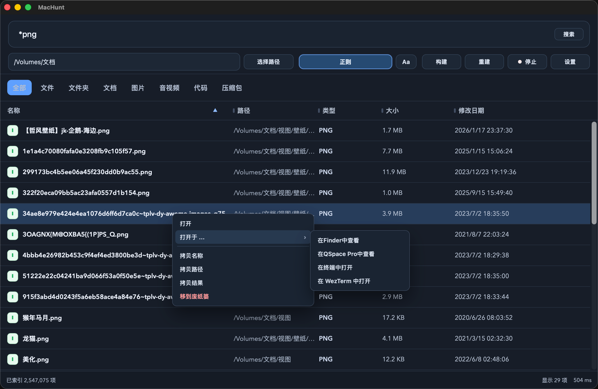

# MacHunt

<p align="center"></p>

一个纯本地运行的 macOS 文件/文件夹搜索工具，提供 CLI 与原生 GUI（Tauri + React）两种入口。不依赖 HTTP 后端，不上传任何数据。

[English](README.md)

## 简介

MacHunt 将你的整个文件系统扫描到本地 SQLite FTS5 索引中。CLI 搜索耗时 <5ms。通过 macOS FSEvents 实现增量实时更新。可以理解为开源的 Spotlight，带强大的 CLI，数据永不离开本机。

## 截图

<table>
<thead>
<tr>
<th width="50%" align="center">搜索</th>
<th width="50%" align="center">收藏</th>
</tr>
</thead>
<tbody>
<tr>
<td align="center"><a target="_blank" rel="noopener noreferrer" href="./screenshots/search.png"></a></td>
<td align="center"><a target="_blank" rel="noopener noreferrer" href="./screenshots/pinned.png"></a></td>
</tr>
<tr>
<td align="center"><strong>全盘搜索、分类标签</strong></td>
<td align="center"><strong>收藏页面，重启数据不丢失</strong></td>
</tr>
</tbody>
</table>

<table>
<thead>
<tr>
<th width="50%" align="center">Quick Look 预览</th>
<th width="50%" align="center">路径过滤与右键菜单</th>
</tr>
</thead>
<tbody>
<tr>
<td align="center"><a target="_blank" rel="noopener noreferrer" href="./screenshots/quicklook.png"></a></td>
<td align="center"><a target="_blank" rel="noopener noreferrer" href="./screenshots/context-menu.png"></a></td>
</tr>
<tr>
<td align="center"><strong>空格触发原生 Quick Look，支持多选</strong></td>
<td align="center"><strong>Finder 选取、右键操作</strong></td>
</tr>
</tbody>
</table>

## 安装

从 [GitHub Releases](https://github.com/dacj4n/MacHunt/releases) 下载最新 `.dmg`，挂载后拖入 `/Applications`。

> **首次启动**：macOS Gatekeeper 可能拦截未签名应用。如果提示"无法验证开发者"或"已损坏"，在 Finder 中右键 `MacHunt.app` → 选择**"打开"** → 弹出对话框中点击**"打开"**。或在终端执行 `xattr -cr /Applications/MacHunt.app` 后重新双击打开。

或从源码构建：

```bash
git clone https://github.com/dacj4n/MacHunt.git
cd MacHunt
```

### 仅 CLI

```bash
cargo build --release
./target/release/machunt --help
```

### GUI（开发）

```bash
npm install
npm run tauri dev
```

### GUI（打包）

```bash
npm run build
npm run tauri build
```

## 环境要求

| macOS 15 (Apple Silicon) | ✅ 已测试 |
| macOS 13–14 | ✅ 预计可用 |
| macOS 10.15–12 | ⚠️ 理论支持（未测试） |
| Intel Mac (x86_64) | ⚠️ 通用二进制已包含，未测试 |

> **说明**：App 构建为通用二进制（arm64 + x86_64）。macOS <13 上登录项功能使用 AppleScript 降级方案，不影响正常使用。

- Rust 1.70+
- Node.js 18+（仅 GUI）
- npm 9+（仅 GUI）

## 快速上手

```bash
# 首先构建索引（全盘扫描，300万文件约 10 秒）
machunt build

# 子串搜索（不区分大小写）
machunt search "预算"

# 通配符模式
machunt search -p "*.rs"

# 模糊/容错搜索
machunt search -F "redme"   # 可找到 README

# 区分大小写
machunt search -c "Makefile"

# JSON 输出，方便脚本处理
machunt search --json "发票" | jq .

# 启动实时监听 + 交互搜索
machunt watch
```

## CLI 命令参考

```
machunt <COMMAND>
```

### `search`

```bash
machunt search [OPTIONS] <QUERY>
```

| 选项 | 说明 |
|------|------|
| `-p, --pattern` | 通配符/正则模式（如 `*.rs`、`test?.txt`） |
| `-F, --fuzzy` | 模糊/容错搜索（Levenshtein 编辑距离） |
| `-c, --case-sensitive` | 区分大小写 |
| `-n, --limit <N>` | 最大结果数（默认 100） |
| `-P, --path <PATH>` | 路径前缀过滤 |
| `-f, --files` | 仅文件 |
| `-d, --dirs` | 仅目录 |
| `--json` | JSON 输出 |

通配符规则：
- `*` — 匹配任意字符不含 `/`（单层目录）
- `**` — 匹配任意字符含 `/`（所有层级）
- `?` — 匹配单个字符不含 `/`
- `{a,b}` — 匹配 `a` 或 `b`

### `build`

```bash
machunt build [OPTIONS]
```

| 选项 | 说明 |
|------|------|
| `-p, --path <PATH>` | 仅构建指定范围 |
| `--rebuild` | 先清空再重建 |
| `--include-dirs <true\|false>` | 是否索引目录（默认 `true`） |

### `watch`

```bash
machunt watch
```

启动 FSEvents 监听，有历史 EventID 时从上次位置续跑，进入终端交互搜索循环。

### `optimize`

```bash
machunt optimize [--vacuum]
```

默认执行 WAL checkpoint，可选 `--vacuum` 回收数据库文件空间。

## 工作原理

```
┌──────────┐     ┌───────────────┐     ┌──────────┐
│  WalkDir  │ ──→ │  SQLite FTS5  │ ←── │ FSEvents │
│  (构建)   │     │  (trigram)    │     │  (监听)  │
└──────────┘     └───────┬───────┘     └──────────┘
                         │
                    ┌────▼────┐
                    │  搜索    │
                    │  <5ms    │
                    └─────────┘
```

- **构建**：`WalkDir` 遍历文件系统，将 `(name_lower, path)` 写入 SQLite FTS5（trigram 分词器）。通过 crossbeam 通道并行处理。
- **搜索**：FTS5 trigram MATCH，CLI 耗时 <5ms。区分大小写时，FTS5 候选结果再经 GLOB 后过滤（SQLite 的 LIKE 对 ASCII 不区分大小写）。短查询（<3 字符）回退到 LIKE。模糊搜索基于 Levenshtein 编辑距离。
- **监听**：通过 CoreServices FFI 直调 FSEvents，监听文件的创建、修改、删除、重命名事件，增量更新索引，重启后从持久化的 EventID 续跑。

## GUI

原生 macOS GUI，基于 Tauri 2 + React。与 CLI 共用同一 Rust 核心引擎——没有 HTTP 服务器，没有额外的 IPC 开销。

### 主窗口

- 实时全盘搜索
- 标签导航：搜索 / 收藏 / 设置（`Cmd+1/2/3`）
- 正则开关 + 区分大小写开关
- 路径过滤（手动输入 + 下拉建议 + Finder 选取）
- 分类标签：全部 / 文件 / 文件夹 / 文档 / 图片 / 音视频 / 代码 / 压缩包
- 表头排序：名称、路径、类型、大小、修改时间
- 列宽拖拽，宽度记忆持久化
- 单选/多选（`Shift` 连选、`Cmd` 多选）
- 键盘导航（`↑` `↓`）
- 空格触发 Quick Look（支持多选）
- 双击打开
- 每行末尾内嵌收藏按钮（hover 时显示）

### 右键菜单

打开、打开于...（Finder / QSpace Pro / Terminal / WezTerm）、拷贝名称/路径、拷贝为文件对象、拷贝所有结果、移到废纸篓、收藏/取消收藏。

### 收藏页面

搜索结果可点击星标收藏到专属收藏页。收藏数据存储在 localStorage（key: `machunt.pinned.items`），重启后数据不丢失。收藏页支持表头排序、列宽拖拽、空格 Quick Look、Cmd+A 全选，点击星标或右键即可取消收藏。星标按钮位于每行末尾，仅在鼠标悬浮时显示——金色实心为已收藏，空心为未收藏。

### 设置页面

- **主题**：浅色 / 深色 / 跟随系统
- **语言**：中文 / English
- **快捷键**：全局唤起/隐藏窗口（默认 `Cmd+Shift+D`）
- **启动**：开机自启、静默启动、显示/隐藏 Dock 图标
- **索引维护**：重建后自动 `VACUUM` 开关
- **排除目录**：完整目录规则 + 正则/通配符规则
- **监听根目录**：指定 FSEvents 监听范围

## 功能概览

| 分类 | 能力 |
|------|------|
| 搜索模式 | 子串、通配符/正则、模糊（Levenshtein） |
| 大小写 | CLI 和 GUI 均可切换 |
| 路径过滤 | 前缀、下拉建议、Finder 选取 |
| 实时更新 | FSEvents 监听，EventID 持久化 |
| 文件分类 | 8 个分类标签（扩展名自动归类） |
| 收藏 | 星标按钮，专属收藏页，localStorage 持久化 |
| 预览 | 原生 Quick Look（空格，支持多文件） |
| 导出 | 拷贝为文件对象、CLI JSON 输出 |
| 设计 | Neomorphic 立体设计系统，浅色/深色/跟随系统 |
| 国际化 | 中文 / English |
| 启动 | 开机自启、静默模式、Dock 开关 |
| 性能 | EventID 淘汰检测、惰性死路径清理 |
| 隐私 | 100% 本地，无网络连接 |

## 对比

| | MacHunt | Spotlight | Raycast | uTools |
|---|---|---|---|---|
| **全盘扫描** | 是（300万文件 ~10s） | 是（`mdfind`） | 插件形式 | 插件形式 |
| **搜索延迟** | <5ms（CLI，FTS5 trigram） | 50–200ms+ | 视插件 | 视插件 |
| **索引格式** | SQLite FTS5（开放） | 私有 | 私有 | N/A |
| **CLI** | 是 | 是（`mdfind`） | 否 | 否 |
| **模糊搜索** | 是（Levenshtein） | 部分 | 否 | 否 |
| **增量更新** | FSEvents | FSEvents | 视情况 | N/A |
| **开源** | 是 | 否 | 否 | 部分 |

## 开发

### 技术栈

- **核心**：Rust
- **CLI**：Clap
- **GUI 前端**：React 18 + TypeScript + Vite
- **GUI 容器**：Tauri 2
- **全局快捷键**：`tauri-plugin-global-shortcut`
- **存储**：SQLite FTS5（`rusqlite`，WAL，trigram tokenizer）
- **扫描**：WalkDir + Crossbeam channels
- **监听**：macOS FSEvents（CoreServices FFI）
- **设计**：Neomorphic 设计系统，CSS 自定义属性，内联主题检测消除首帧闪烁

### 构建命令

| 命令 | 说明 |
|------|------|
| `npm run build` | 仅构建前端（TS + Vite → `dist/`） |
| `npm run tauri build` | 完整构建：前端 + Rust → `.app` / `.dmg` |
| `npm run tauri dev` | 开发模式（热重载） |
| `cargo build --release` | 仅 CLI 二进制 |

### `npm run build` 与 `npm run tauri build` 的区别

- `npm run build` 只构建前端资源，**不**编译 Rust，**不**生成 `.app` / `.dmg`。
- `npm run tauri build` 先执行 `beforeBuildCommand`（即 `npm run build`），再编译 Rust 后端，最终输出可安装产物。

## 项目结构

```
mac_find/
├── src/                    # 核心引擎（CLI 与 GUI 共用）
│   ├── main.rs             # CLI 入口（clap）
│   ├── lib.rs              # 库入口，导出 Engine
│   ├── engine.rs           # 引擎：构建/搜索/监听调度
│   ├── db.rs               # SQLite FTS5：建表、插入、搜索、模糊
│   ├── builder.rs          # WalkDir 文件系统扫描器
│   ├── watcher.rs          # FSEvents FFI 监听器
│   ├── search.rs           # 通配符转正则
│   ├── filters.rs          # 排除规则（精确 + 正则/通配符）
│   └── utils.rs            # 路径规范化、跳过逻辑、日志
├── src-tauri/              # Tauri GUI 后端
│   ├── src/lib.rs          # Tauri 命令、窗口生命周期、设置
│   ├── tauri.conf.json     # Tauri 配置
│   ├── Info.plist          # macOS Bundle 元数据
│   ├── build.rs            # 构建脚本（编译 ObjC 桥接代码）
│   └── macos/
│       └── quicklook_bridge.m  # ObjC 桥接：Quick Look、剪贴板、Dock
├── src/                    # React 前端（neomorphic 设计系统）
│   ├── App.tsx             # 主应用组件（~3300 行，所有视图）
│   ├── App.css             # 样式（CSS 变量、neomorphic 主题）
│   ├── main.tsx            # 入口
│   └── index.html          # HTML 外壳，内联主题检测脚本
├── screenshots/            # README 截图
├── scripts/
│   ├── set_version.sh      # 统一更新各配置文件的版本号
│   └── package_release.sh  # 打包 .app/.dmg
├── Cargo.toml              # Rust crate 配置
└── package.json            # 前端依赖
```

## 运行时数据

| 路径 | 内容 |
|------|------|
| `~/Library/Caches/MacHunt/index.db` | FTS5 搜索索引 |
| `~/Library/Application Support/MacHunt/settings.json` | GUI 配置 |
| `~/Library/Caches/MacHunt/logs/` | 调试日志 |

## 为什么索引文件会很大

- macOS 上百万级文件很常见
- 默认索引目录条目
- 路径字符串较长，文本存储成本高
- 写入期间 `index.db-wal` 会临时增大

维护建议：

```bash
machunt optimize --vacuum
```

## 许可证

MIT
