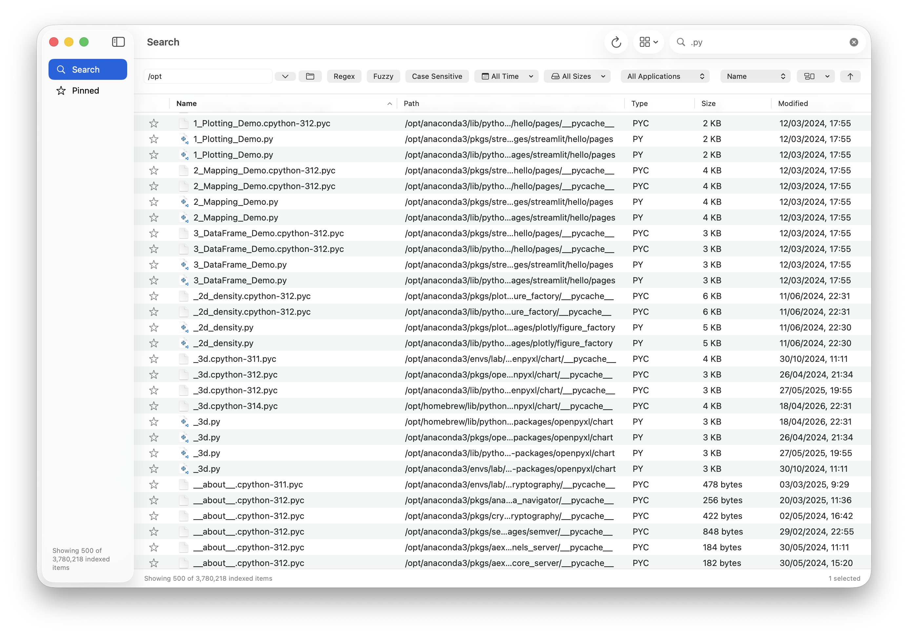
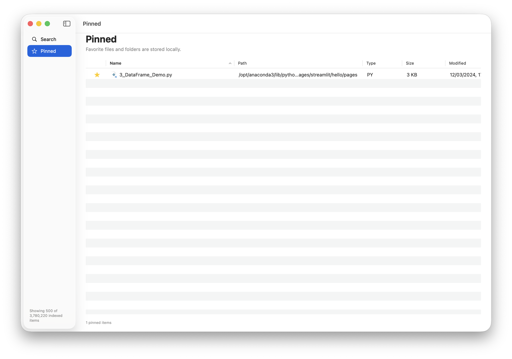
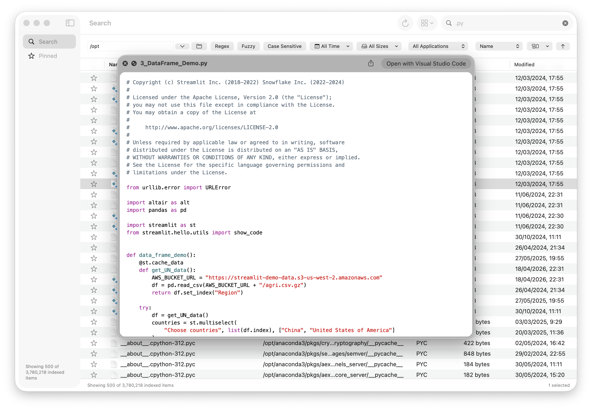
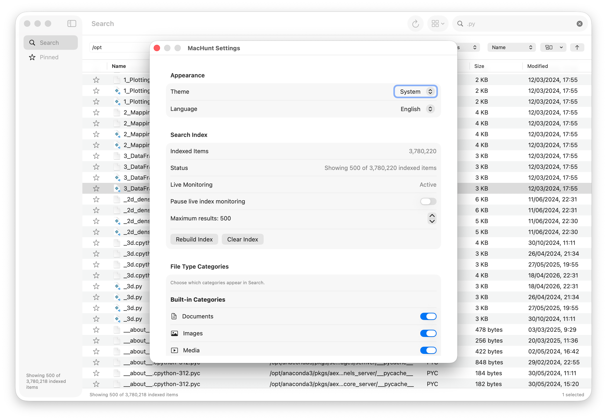

<p align="center"></p>

<h1 align="center">MacHunt</h1>

<p align="center">
  一款完全本地、注重隐私的 macOS 文件搜索工具。<br>
  新测试版完全使用 Swift 与 Apple 原生框架实现。
</p>

<p align="center">
  
  
  
  
</p>

<p align="center"><a href="README.md">English</a></p>

> [!IMPORTANT]
> Swift 原生版本目前仍是测试版，源代码位于 [`swift_beta`](swift_beta/)；原来的 Tauri/React/Rust 版本继续保留在仓库根目录，没有删除或覆盖。

## MacHunt 是什么？

MacHunt 把文件与文件夹的元数据写入本机 SQLite FTS5 索引，并通过原生 macOS App 和 CLI 提供快速文件名搜索。搜索数据只保存在本机：不需要账户，不依赖 HTTP 后端，不使用云搜索 API，也没有分析服务。

Swift 测试版使用 SwiftUI、AppKit、Quick Look、Finder 集成、FSEvents、ServiceManagement 和 SQLite，是独立实现，不链接旧版 Rust 核心。

## 截图

| 搜索 | 收藏 |
|:--:|:--:|
| [](screenshots/swift/search.png) | [](screenshots/swift/pinned.png) |
| 原生结果表格、筛选、元数据与文件操作 | 持久化收藏，使用同一套 Finder 风格操作 |

| Quick Look | 设置 |
|:--:|:--:|
| [](screenshots/swift/quick-look.png) | [](screenshots/swift/settings.png) |
| 按空格调用系统 Quick Look 面板 | 管理索引、分类、排除规则、外观和系统集成 |

## 安装测试版

1. 从 [GitHub Releases](https://github.com/Jingyuan-Zheng/MacHunt_SwiftUI/releases) 下载最新 Swift 测试版 `.dmg`。
2. 打开磁盘映像。
3. 将 `MacHunt.app` 拖入“应用程序”。

当前测试版使用本地临时签名，尚未公证。如果 Gatekeeper 阻止首次启动，请在 Finder 中右键 App，选择**打开**。如果 macOS 仍提示 App 已损坏，可以对你确认可信的副本执行：

```bash
xattr -cr /Applications/MacHunt.app
```

目前发布的测试版面向 Apple 芯片，最低要求 macOS 14。

## 第一次使用

MacHunt 可以在 App 内自动建立首个索引。如果希望在终端中看到完整进度，请先退出 MacHunt，然后执行：

```bash
"/Applications/MacHunt.app/Contents/Helpers/machunt" build --path /
```

重建过程会显示四个阶段：

```text
扫描文件
构建搜索索引
优化数据库
完成索引
```

命令输出最终项目数量后再打开 MacHunt。之后的文件变化由 FSEvents 增量维护。

## Swift 原生测试版功能

- SwiftUI 原生窗口与 AppKit 结果表格，采用 macOS 系统默认视觉
- 子串、通配符/正则、模糊和区分大小写搜索
- 路径、文件分类、应用、日期和大小筛选
- 可修改自带分类，并可建立任意数量的自定义分类
- 自定义分类支持 SF Symbols 与 Emoji 图标
- Finder 风格的可选列、排序、多选和键盘操作
- 名称、路径、类型、大小、修改日期、添加日期、Finder 标签与 iCloud 状态
- 打开、打开方式、在 Finder 中显示、复制、移到废纸篓、收藏及右键菜单
- 按空格调用系统 Quick Look，支持多文件预览
- 跨启动保存的收藏项目
- FSEvents 增量索引维护和外置磁盘监控
- 可配置索引位置、排除路径/规则、隐藏文件和最大结果数
- 原生菜单、全局快捷键、登录启动与 Dock 显示控制
- English / 简体中文
- App 与 CLI 共用 Swift 搜索核心和数据库

## 隐私与 iCloud 文件

MacHunt 索引名称、路径、日期、大小、Finder 标签和云端状态，不索引文件正文。扫描仅在云端的 iCloud 占位文件时，不会主动下载文件内容；打开或使用 Quick Look 预览这类结果时，macOS 可能会下载对应文件。

运行数据保存在：

```text
~/Library/Caches/MacHuntSwift/index.db
```

重建采用原子替换：MacHunt 在 `index.db.new` 中建立新索引，旧索引仍可搜索；新索引完成并优化后才替换正式数据库。

## CLI

CLI 位于 `MacHunt.app/Contents/Helpers/machunt`。

```bash
machunt build --path /
machunt status
machunt search invoice
machunt search --fuzzy --limit 50 "project report"
machunt search --pattern "*.swift"
machunt search --path ~/Documents --json budget
machunt optimize
```

搜索选项：

| 选项 | 说明 |
|---|---|
| `-p`、`--pattern` | 通配符或正则模式 |
| `-F`、`--fuzzy` | 按顺序进行模糊子序列匹配 |
| `-c`、`--case-sensitive` | 区分大小写 |
| `-P`、`--path <path>` | 限定路径前缀 |
| `-f`、`--files` | 仅文件 |
| `-d`、`--dirs` | 仅文件夹 |
| `-n`、`--limit <count>` | 最大结果数量 |
| `--json` | JSON 输出 |

## 构建 Swift 测试版

```bash
git clone https://github.com/Jingyuan-Zheng/MacHunt_SwiftUI.git
cd MacHunt_SwiftUI/swift_beta
swift test
scripts/build-app.sh release
open .build/MacHunt.app
```

要求 Xcode、Swift 6.2 或更高版本，以及 macOS 14 或更高版本。架构和开发说明见 [`swift_beta/README.md`](swift_beta/README.md)。

## 仓库结构

```text
MacHunt_SwiftUI/
├── swift_beta/        # SwiftUI/AppKit App、核心、CLI、测试与打包文件
├── screenshots/swift/ # 当前原生测试版截图
├── src-tauri/         # 旧版 Tauri 应用容器
├── src/               # 旧版 Rust 核心与 React 前端源代码
├── Cargo.toml         # 旧版 Rust 配置
└── package.json       # 旧版 React/Tauri 工具链
```

## 旧版 Tauri

原来的 Tauri 版本继续保留，可以用于对照，也仍可构建：

```bash
npm install
npm run tauri dev
```

旧版 Rust CLI 可通过 `cargo build --release` 构建。新的原生开发放在 `swift_beta`。
